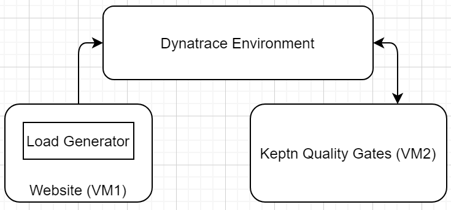
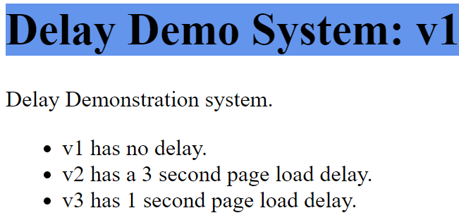
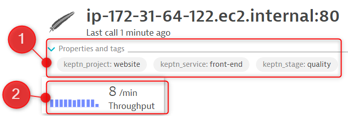

# keptn-quality-gate-files



Files and resources to demonstrate usage of Keptn Quality Gates in non-cloud setups.

The files here help to create a demo system with a 2 VM setup.

## VM1: Website + Load Generator
This VM should be an Ubuntu `t3.small` with 20GB HDD space.

### VM1 Setup
1. Launch an `Ubuntu Server 18.04` instance in EC2. Give it 20GB HDD space. Allow HTTP and SSH traffic.
2. SSH into the instance, then run:
```
cd ~
wget https://raw.githubusercontent.com/Dynatrace-Adam-Gardner/keptn-quality-gate-files/master/websiteSetup.sh
chmod +x websiteSetup.sh
```
3. Open this file and modify lines `13`, `14` and `15` to reflect your details.
4. Execute this file with:
```
./websiteSetup.sh
```

When this file is completed, you will have:
1. A working website running on port 80.
2. This VM will be monitored by the Dynatrace OneAgent.
3. The setup script creates some automatic tag rules in your Dynatrace environment (`keptn_deployment`, `keptn_project`, `keptn_service` and `keptn_stage`).
4. The setup launches a load generator which hits the website once every few seconds.
5. In Dynatrace you'll see the apache process group with `keptn_*` tags and two services, also tagged.
6. Notice that the service has a consistent traffic level.

Navigate to the VM IP address and you'll see `v1` of the website:



### Validating the Service Setup
Navigate into your service. It **must** have these four tags associated: `keptn_deployment`, `keptn_project: website`, `keptn_service: front-end` and `keptn_stage: quality`. It must also have traffic running through the service.



---

## VM2: Keptn Quality Gate Component
This VM should be an Ubuntu `t3.small` with 20GB HDD space.

### VM2 Setup
1. Launch an `Ubuntu Server 18.04` instance in EC2. Give it 20GB HDD space. Allow HTTP and SSH traffic.
2. SSH into the instance, then run:
```
cd ~
wget https://raw.githubusercontent.com/Dynatrace-Adam-Gardner/keptn-quality-gate-files/master/keptnSetup.sh
chmod +x keptnSetup.sh
```
3. Open this file and modify lines `15` and `16` to reflect your details.
4. Execute this file with:
```
./keptnSetup.sh
```

When this file is completed, you'll have:
1. A VM running a single node Kubernetes cluster using minikube.
2. Keptn installed on the k8s cluster running the `quality gate` use case.
3. A project called `website` configured in keptn with a single stage called `quality`.
4. Keptn has the Dynatrace SLI provider installed.
5. Keptn is configured to use Dynatrace SLI provider on the `website` project.
6. Keptn is configured to evaluate the service based on thresholds provided in the SLO file.

# Evaluating Services with Keptn
Evaluating your service is easy, just run the following command.
This will trigger keptn to start an evaluation of the `front-end` service in the `quality` stage of the `website` project and grab the metrics from the previous 2 minutes.
```
keptn send event start-evaluation --project=website --stage=quality --service=front-end --timeframe=2m
```

This command will return a `keptn context` ID:
```
Starting to send a start-evaluation event to evaluate the service front-end in project website
ID of Keptn context: *****
```

## Retrieving Keptn Evaluation
Use the `keptn context` ID from the previous command to look for the `evaluation-done` event and retrieve the status of the evaluation. 

Note that the evaluation will not be available immediately. In which case, you'll see an error message. Your tooling should deal with this gracefully.
```
keptn get event evaluation-done --keptn-context=*****
```

### Evaluation Not Yet Completed
When the evaluation isn't yet ready, you'll see this:
```
Starting to get evaluation-done event
Get evaluation-done event was unsuccessful
Error: No Keptn sh.keptn.events.evaluation-done event found for context: *****
```

### Evaluation Completed
When the `evaluation-done` event exists for this `keptn context` (ie. when the evaluation is ready) you'll see:

```
Starting to get evaluation-done event
# JSON Content of the evaluation...
```

## Did it Pass?
The output lists everything about this test (even the SLOs used to judge the thresholds).
But what you're probably looking for is the `data.result` value:
```
{
	"contenttype": "application/json",
	"data": {
		...
		"result": "pass",
		...
	},
	...
}
```
